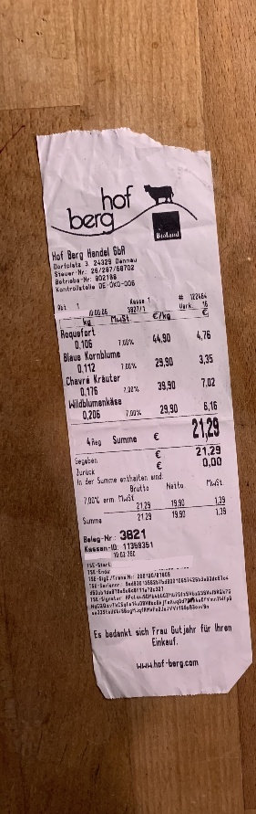
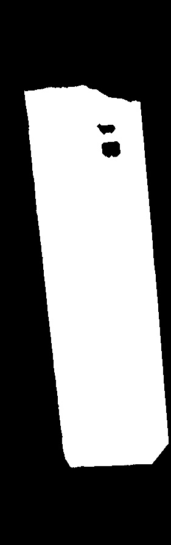

# pixelshop

pixelshop is a python [fluent interface](https://en.wikipedia.org/wiki/Fluent_interface#Python) wrapper for image manipulation using the open-source Computer Vision library [OpenCV](https://opencv.org/).

This approach allows method chaining, making the code more legible. To avoid [unwanted side effects](https://mail.python.org/pipermail/python-dev/2003-October/038855.html) a deep copy is created before each method call.

> [!Warning]
> pixelshop is in development.

## Examples

### Example 1: Find bon silhoutte

```python
#!/usr/bin/env python3

from pixelshop.flags import ThresholdTypes
from pixelshop.image import DevelopedImage

bon = (
    DevelopedImage.fromFile("examples/bon.jpg", proxyPixelCount=500 * 500)
    .useProxy()  # Proceed with a low resolution version to improve speed
    .appendToFilename("small")
    .saveImage()
    .colorBGR2HSV()  # Convert to HSV
    .keepChannels(keepChannels=[1, 3, 3])  # Keep the average of channels 1, 3 and 3
    .denoise(strength=15)  # Denoise
    .morphologicalTransformClosing(kernelSize=(3, 3), iterations=2)  # Remove text
    .adaptiveThreshold(
        thresholdType=ThresholdTypes.THRESH_BINARY,
        blockSize=1000,
        C=-12,
    )  # Threshold the image to get silhouette
    .morphologicalTransformClosing(kernelSize=(3, 3), iterations=3)  # Final clean up
    .appendToFilename("silhouette")
    .saveImage()
    .show()  # Display result
)
```

[Code file](./example_bon_silhouette.py)

| original | silhouette |
| --- | --- |
|  |  |

### Example 2: Enhance sudoku grid

```python
#!/usr/bin/env python3

from pixelshop.flags import ThresholdTypes
from pixelshop.image import DevelopedImage

bon = (
    DevelopedImage.fromFile("examples/sudoku.png", proxyPixelCount=500 * 500)
    .useProxy()  # Proceed with a low resolution version to improve speed
    .appendToFilename("small")
    .saveImage()
    .colorBGR2Gray()  # Convert to gray
    .show()
    .denoise(strength=3)
    .show()
    .adaptiveThreshold(
        thresholdType=ThresholdTypes.THRESH_BINARY, blockSize=250
    )  # Threshold the image to get grid
    .appendToFilename("enhanced")
    .saveImage()
    .show()  # Display result
)
```

[Code file](./example_sudoku_silhouette.py)

| original | silhouette |
| --- | --- |
|  |  |

## Installation

### A. Install package manager _uv_

1. Install `uv` by following Astral's [Getting Started guide](https://github.com/astral-sh/uv?tab=readme-ov-file#getting-started).
    - macOS:  using Homebrew with `brew install uv`

### B. Install _pixelshop_

1. Clone the repository using `git clone <repo-url> <path-to-clone-to>`.
2. Create a virtual python environment
    1. `cd` into the directory of the repository
    2. Create a virtual python 3.12 environment with

        ```console
        uv venv -p 3.12
        ```

3. Install Python dependencies

    1. Activate the virtual environment with

        ```console
        source .venv/bin/activate
        ```

    2. Install the requirements with

        ```console
        uv pip install -r requirements.txt
        ```

## Architecture

### Method chaining

The method chaining without side effects is implemented in the [`@chainable`](./pixelshop/decorators.py) decorator.

## Dependencies

- _OpenCV_ for image processing: [source](https://github.com/opencv/opencv-python), [docs](https://docs.opencv.org/4.x/), [website]([OpenCV](https://opencv.org/))
- _NumPy_: [source](https://github.com/numpy/numpy), [docs](https://numpy.org/doc/stable/), [website](https://numpy.org/)
